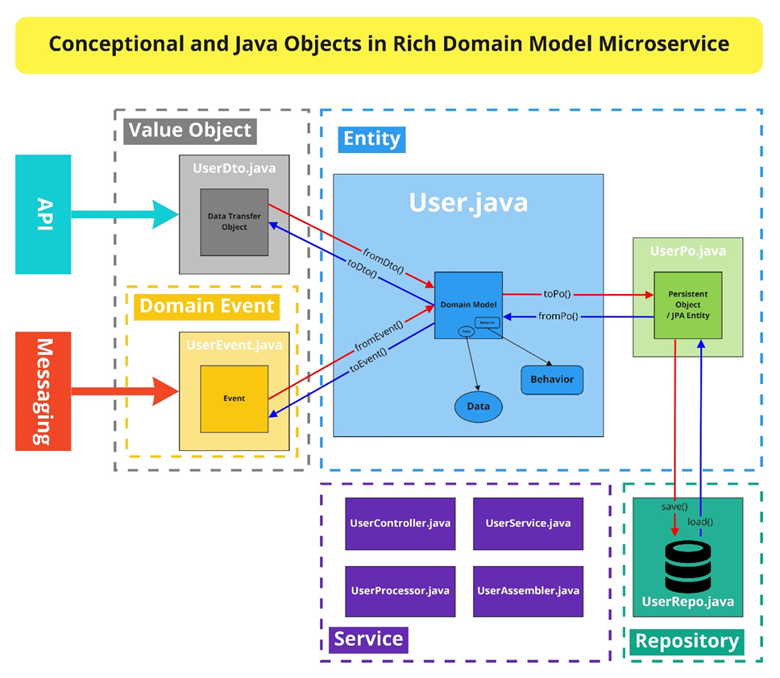

# equipment

## Springboot

###Link: 
https://spring.io/projects/spring-boot

###Quick start:  

https://spring.io/quickstart  
https://docs.spring.io/spring-boot/docs/current/reference/htmlsingle/#getting-started.first-application

###Features:
 
1. Create stand-alone Spring applications

2. Embed Tomcat, Jetty or Undertow directly (no need to deploy WAR files)

3. Provide opinionated 'starter' dependencies to simplify your build configuration

4. Automatically configure Spring and 3rd party libraries whenever possible

5. Provide production-ready features such as metrics, health checks, and externalized configuration

6. Absolutely no code generation and no requirement for XML configuration

###Annotations: 

####@SpringBootApplication - DynamicsLabApplication.java
Main Application Class.

#### @Service - ItemService.java
Contains the Business logic

#### @Controller 
It is a specialization of @Component. It marks a class as a
web request handler. It is often used to serve web pages. By default, it returns a string that indicates which route to
redirect. It is mostly used with @RequestMapping annotation.

#### @Repository - ItemRepository.java
The repository is a DAOs (Data Access Object) that access the database directly. The repository does all the 
operations related to the database.

#### @Component
It is a class-level annotation. It is used to mark a Java class as a bean. A Java class annotated with @Component is found during the classpath. The Spring Framework pick it up and configure it in the application context as a Spring Bean.

####@Autowired
If a bean has more than one constructor, you will need to mark the one you want Spring to use with @Autowired. 

####@GetMapping 
It maps the HTTP GET requests on the specific handler method. It is used to create a web service endpoint that fetches.
Same as using @RequestMapping(method = RequestMethod.GET)

####@PostMapping
It maps the HTTP POST requests on the specific handler method. It is used to create a web service endpoint.
Same as using @RequestMapping(method = RequestMethod.POST)

####@PutMapping
It maps the HTTP PUT requests on the specific handler method. It is used to create or update the source.
Same as using RequestMapping(method = RequestMethod.PUT)

#### @Data 
@Data is a convenient shortcut annotation that bundles the features of @ToString, @EqualsAndHashCode, @Getter / @Setter a
nd @RequiredArgsConstructor together

@DeleteMapping   
It maps the HTTP DELETE requests on the specific handler method. 
It is used to create a web service endpoint that deletes a resource. 
It is used instead of using: @RequestMapping(method = RequestMethod.DELETE)

@PatchMapping   
It maps the HTTP PATCH requests on the specific handler method. 
It is used instead of using: @RequestMapping(method = RequestMethod.PATCH)

@RequestBody   
It is used to bind HTTP request with an object in a method parameter. 
Internally it uses HTTP MessageConverters to convert the body of the request. 
When we annotate a method parameter with @RequestBody, the Spring framework binds the incoming HTTP request body to that
parameter.

@ResponseBody   
It binds the method return value to the response body. It tells the Spring Boot Framework to serialize
a return an object into JSON and XML format.

@PathVariable   
It is used to extract the values from the URI. It is most suitable for the RESTful web service, 
where the URL contains a path variable. We can define multiple @PathVariable in a method.

@RequestParam   
It is used to extract the query parameters form the URL. It is also known as a query parameter. 
It is most suitable for web applications. It can specify default values if the query parameter is not present in the URL.

@RequestHeader    
It is used to get the details about the HTTP request headers. We use this annotation as a method 
parameter. The optional elements of the annotation are name, required, value, defaultValue. For each detail in the 
header, we should specify separate annotations. We can use it multiple time in a method

@RestController   
It can be considered as a combination of @Controller and @ResponseBody annotations. The 
@RestController annotation is itself annotated with the @ResponseBody annotation. It eliminates the need for annotating 
each method with @ResponseBody.

@RequestAttribute   
It binds a method parameter to request attribute. It provides convenient access to the request 
attributes from a controller method. With the help of @RequestAttribute annotation, we can access objects that are 
populated on the server-side.

## Spring Data JPA

Spring Data JPA provides repository support for the Java Persistence API (JPA). It eases development of
applications that need to access JPA data sources.

###Link: 
https://docs.spring.io/spring-data/jpa/docs/current/reference/html/

####@Entity 
object entity 

####@Id 
Primary key

####@ManyToOne, @OneToMany, @OneToOne, @ManyToMany
Left join, Inner join....

##Maven

Apache Maven is a software project management and comprehension tool.

###Link:
https://maven.apache.org/guides/index.html  
https://maven.apache.org/guides/getting-started/maven-in-five-minutes.html

##Hexagon Architecture 

The hexagonal architecture divides a system into several loosely-coupled interchangeable components, such as the 
application core, the database, the user interface, test scripts and interfaces with other systems. This approach 
is an alternative to the traditional layered architecture.

Each component is connected to the others through a number of exposed "ports". Communication through these ports
follow a given protocol depending on their purpose. Ports and protocols define an abstract API that can be implemented
by any suitable technical means.

Links:  
https://en.wikipedia.org/wiki/Hexagonal_architecture_%28software%29  
https://insights.thoughtworks.cn/architecture-from-sandwich-to-hexagon/  
301/302 Moved Permanently（重定向）请求的URL已移走。  
304 Not Modified（未修改）客户的缓存资源是最新的，要客户端使用缓存  
403	Forbidden（禁止）请求被服务器拒绝了  
404 Not Found 未找到资源  
500	Internal Server Error(内部服务器错误)服务器遇到一个错误，使其无法为请求提供服务  
503	Service Unavailable（未提供此服务）服务器目前无法为请求提供服务，但过一段时间就可以恢复服务  

### HTTP数据传输
先来看看 HTTP 是如何传输表单数据的。HTTP 是以ASCII 码传输的，建立在TCP/IP 协议之上的应用层规范。HTTP 请求包括：请求行、请求头、消息主体数据。

### HTTP 缓存有哪几种？

ETag 是通过对比浏览器和服务器资源的特征值（如MD5）来决定是否要发送文件内容，
如果一样就只发送 304（not modified）
Expires 是设置过期时间（绝对时间），但是如果用户的本地时间错乱了，可能会有问题
CacheControl: max-age=3600 是设置过期时长（相对时间），跟本地时间无关。

### PUT 
Modify a single resource which is already a part of resources collection

### POST
Add a child resource under resources

### GET 
Read 

### PATCH 
Update/Modify 

### DELETE 

## RESTful API 
A RESTful API is an architectural style for an application program interface (API) that uses 
HTTP requests to access and use data. That data can be used to GET, PUT, POST and DELETE data
types, which refers to the reading, updating, creating and deleting of operations concerning 
resources.

scheme：底层用的协议，如https，http，ftp  
host：服务端域名或者ip地址  
port：端口  
path：访问资源的路径  
query：查询字符串，客户端发送给服务器的参数，更多的是发送数据分页、排序参数  
fragment：锚点，定位到页面的资源  

### Example 
GET: /users/{userid}  
POST: /users  
PUT: /users/{userid}  
DELETE:/users/{userid}  

## Transmission Control Protocol

传输控制协议是一种面向连接的、可靠的、基于字节流的传输层通信协议

###Link: 
https://en.wikipedia.org/wiki/Transmission_Control_Protocol

## User Datagram Protocol

用户资料包协议, 又称用户资料包协议, 是一个简单的面向资料包的通信协议

### Link: 
https://en.wikipedia.org/wiki/User_Datagram_Protocol

## tcp和udp的区别?

基于连接与无连接；
对系统资源的要求（TCP较多，UDP少）
UDP程序结构较简单
流模式与数据报模式
TCP保证数据正确性，UDP可能丢包，TCP保证数据顺序，UDP不保证。

